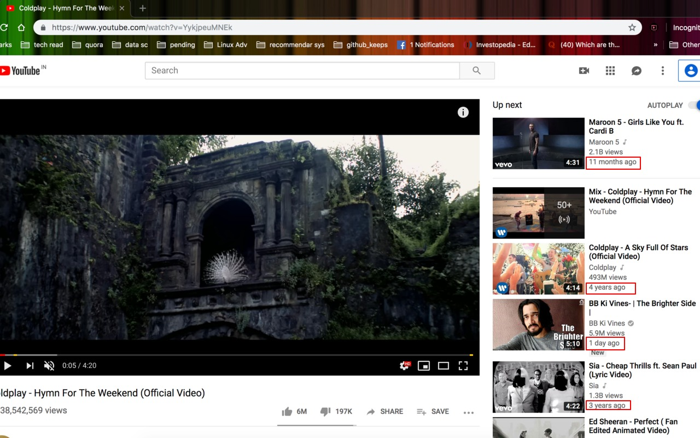

YouTube Video List Dater
========================

Ever wondered if you could get the published/uploaded date of related videos in youtube without even opening the videos, here is an extension which will solve this for you.

I made it coz I needed it. :wink:

### To Install

* From the webstore: [YouTube Video List Dater](https://chrome.google.com/webstore/detail/youtube-video-list-dater/mbaflkdlneldejanggphlhcepncjfaco) 

* For development:

	1. Clone this repo
	2. Open up Chrome and go to the extensions page (Window → Extensions)
	3. Enable developer mode (if it’s not already)
	4. Click on “Load unpacked extension”
	5. Select the folder for this app

### Extra notes:

*   Please report any bugs that you find as issues on the project

### Update

* ***v2.0 -***
	
	1. publish date of `show more` videos
	2. run script on dom history change

* ***v2.0.1 -***

	1. fixing double dates when playing playlist

* ***v2.1.1 -***

	1. remove Published/Uploaded prefix from date
	2. added loader gif
	3. changed date to time difference
